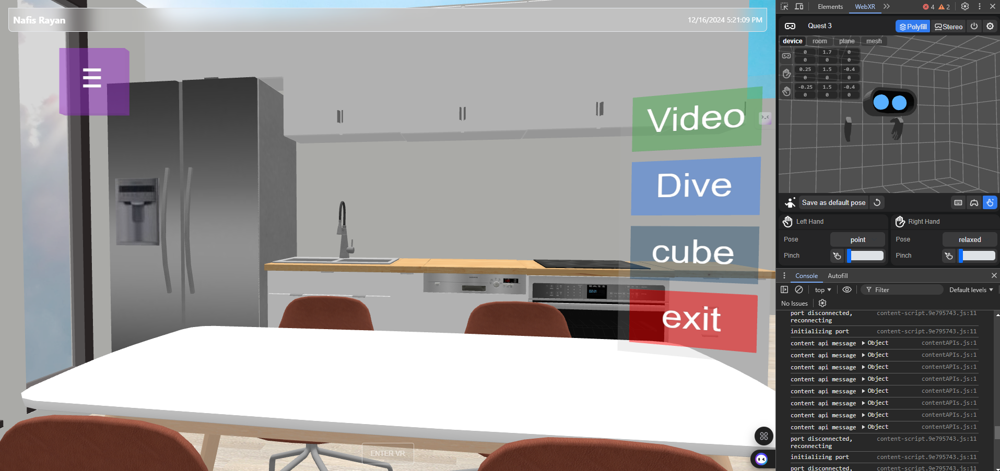

# Three.js VR Hand Input with Flask and YOLO

This project is a web-based application that integrates Three.js for 3D rendering, WebXR for VR hand input, and Flask for serving the application. It also uses YOLO for object detection in video feeds. The application has been **modularized** for better maintainability, scalability, and development experience.

## Features

- **3D Environment**: Built with Three.js, allowing for interactive 3D scenes.
- **VR Hand Input**: Utilizes WebXR for hand tracking and interaction.
- **Voice Chat with AI**: Integrated speech recognition with AI responses via Hugging Face API.
- **Object Detection**: Integrates YOLO for real-time object detection in video feeds.
- **Voice Chat with AI**: Integrated speech recognition with AI responses via Hugging Face Google Gemma 2-9B model.
- **Flask Backend**: Serves the application and handles video processing.
- **Interactive UI**: Includes a map and chat system embedded in iframes.
- **Modular Architecture**: Clean, maintainable code structure with separated components.

## Screenshots  

Here are some screenshots of the app showcasing its key features and design:  

  

## Architecture

This project follows a **modular architecture** with clear separation of concerns:

### Frontend Architecture
- **Component-based design** with ES6 modules
- **Entity Component System (ECS)** for 3D object management
- **Manager pattern** for different subsystems
- **Utility modules** for shared functionality

### Modular Structure
```
static/
├── css/
│   └── main.css                    # All styles and animations
├── js/
│   ├── main.js                     # Main application entry point
│   ├── components/                 # Reusable components
│   │   ├── ECSComponents.js        # Entity Component System components
│   │   ├── SceneManager.js         # Three.js scene setup
│   │   ├── WebXRManager.js         # VR/AR and hand tracking
│   │   ├── UIManager.js            # UI elements and menus
│   │   └── VoiceChatSystem.js      # Voice chat with AI
│   ├── systems/
│   │   └── ECSSystems.js           # ECS processing systems
│   └── utils/
│       ├── controls.js             # Input handling
│       └── datetime.js             # DateTime utilities
```

For detailed information about the modular architecture, see [MODULARIZATION_GUIDE.md](MODULARIZATION_GUIDE.md).

## Prerequisites

- Python 3.x
- Node.js and npm (for Three.js and other frontend dependencies)
- Flask
- OpenCV
- Ultralytics YOLO
- Node.js and npm (for Three.js and other frontend dependencies)
- Modern web browser with WebXR support

## Installation

1. **Clone the repository**:
   ```bash
   git clone https://github.com/NafisRayan/Thesis
   cd Thesis
   ```

2. **Set up the Python environment**:
   ```bash
   python -m venv venv
   source venv/bin/activate  # On Windows use `venv\Scripts\activate`
   ```

3. **Install Python dependencies**:
   ```bash
   pip install -r requirements.txt
   ```

4. **Download the YOLO model**:
   - The YOLO model file (`yolo11n.pt`) should be placed in the project directory. You can download it from [link to model].

## Usage

### Using the Modular Version (Recommended)

1. **Run the Flask application**:
   ```bash
   python app.py
   ```

2. **Update app.py to use the modular template** (if not already done):
   ```python
   @app.route('/')
   def index():
       return render_template('index_modular.html')  # Use modular version
   ```

3. **Access the application**:
   - Open your web browser and go to `http://localhost:5000`.

### Controls

- **WASD**: Move camera in 3D space
- **Q/E**: Move camera up/down
- **Mouse**: Look around (click and drag)
- **VR Mode**: Use the VR button for immersive experience
- **Voice Chat**: Click the voice button or use menu toggle

## Project Structure

### Core Files
- `app.py`: The main Flask application file
- `templates/index_modular.html`: Clean, modular HTML template
- `templates/index.html`: Original monolithic file (legacy)
- `static/`: Modularized static files (CSS, JavaScript)
- `assets/`: 3D models, fonts, and other assets

### Documentation
- `MODULARIZATION_GUIDE.md`: Detailed guide on the modular architecture
- `VOICE_CHAT_SETUP.md`: Voice chat system documentation
- `Readme.md`: This file

### Key Components
- **SceneManager**: Handles Three.js scene, lighting, and 3D models
- **WebXRManager**: Manages VR/AR functionality and hand tracking
- **UIManager**: Controls 3D menus, buttons, and interactions
- **VoiceChatSystem**: Handles speech recognition and AI responses
- **ControlsManager**: Manages keyboard/mouse input
- **ECS System**: Entity-Component architecture for 3D objects

## Configuration

- **Video Source**: The video source is set to `video.mp4` in `app.py`. Change this to `0` for the default camera or another video file.
- **Model Path**: Update the YOLO model path in `app.py` if necessary.
- **AI API Key**: Update the Hugging Face API key in `templates/index.html` as described in [`VOICE_CHAT_SETUP.md`](VOICE_CHAT_SETUP.md) for voice chat functionality.
- **Template Selection**: Choose between `index.html` (original) or `index_modular.html` (recommended) in `app.py`.

## Development

### Adding New Features

1. **Create a new component** in the appropriate directory (`components/`, `systems/`, or `utils/`)
2. **Import and initialize** the component in `main.js`
3. **Add required styles** to `main.css`
4. **Update documentation** as needed

### Benefits of Modular Architecture

- **Maintainability**: Easy to locate and fix bugs
- **Reusability**: Components can be reused across projects
- **Scalability**: Easy to add features without affecting existing code
- **Testing**: Each component can be tested independently
- **Performance**: Better caching and optimization possibilities

## Troubleshooting

- Ensure all dependencies are installed correctly.
- Check the browser console for any JavaScript errors.
- Verify the paths to assets and models are correct.
- For WebXR issues, ensure you're using a compatible browser and device.
- For voice chat issues:
  - Check microphone permissions and browser compatibility.
  - Ensure the Hugging Face API key is correctly configured in `templates/index.html`.
  - Verify that the necessary audio permissions are granted in the browser.

### Common Issues

1. **Modules not loading**: Ensure you're serving the app via HTTP/HTTPS, not file://
2. **VR not working**: Check WebXR browser support and device compatibility
3. **Voice chat not responding**: Verify microphone permissions and API key configuration
4. **3D models not loading**: Check GLTF file paths in `SceneManager.js`

## Contributing

1. Fork the repository.
2. Create a new branch (`git checkout -b feature/your-feature`).
3. Follow the modular architecture when adding new features.
4. Update documentation for any new components.
5. Commit your changes (`git commit -am 'Add new feature'`).
6. Push to the branch (`git push origin feature/your-feature`).
7. Create a new Pull Request.

### Development Guidelines

- Follow the established modular pattern
- Keep components focused on single responsibilities
- Document new components in `MODULARIZATION_GUIDE.md`
- Maintain backward compatibility when possible
- Add appropriate error handling and logging

## Acknowledgments

- [Three.js](https://threejs.org/) - 3D graphics library
- [Flask](https://flask.palletsprojects.com/) - Python web framework
- [Ultralytics YOLO](https://github.com/ultralytics/yolov5) - Object detection
- [WebXR](https://immersive-web.github.io/webxr/) - VR/AR web standards
- [ECSY](https://ecsy.io/) - Entity Component System
- [Hugging Face](https://huggingface.co/) - AI model inference

## License

This project is licensed under the MIT License - see the LICENSE file for details.

---

**Note**: This project has been modularized for better maintainability and development experience. See `MODULARIZATION_GUIDE.md` for detailed information about the architecture and how to work with the modular components.
